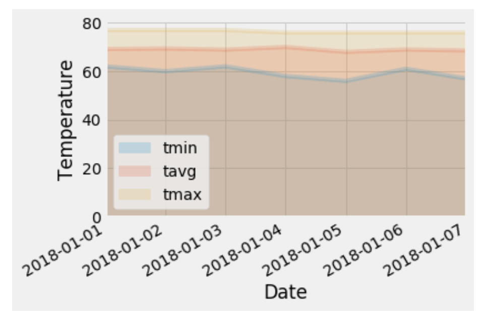

# SQL Alchemy & Flask App Project

## Objective

The goal of this project is to build a Flask application to do basic climate analysis and data exploration of a sqlite database and create visuals to present the data.

## Technologies used

#### Python, SQLAlchemy ORM queries, Flask, Weather API, Pandas, and Matplotlib.

* SQLAlchemy used to connect to your sqlite database.

* SQLAlchemy `automap_base()` used to reflect tables into classes and save a reference to those classes.

* Weather APIs (Application Programming Interfaces) to connect to large databases of weather forecast and historical information from the web.

### Precipitation Analysis

For this analysis, 12 months of history of precipitation data were retrieved and loaded into a Pandas DataFrame.

Summary Statistics for precipitation useing Pandas:
  
  

### Station Analysis

Histogram of 12 months of temperature observation data
  

- - -

### Climate App

Designed a Flask API 

### Temperature Analysis

Plot of the min, avg, and max temperature from your previous query as a bar chart.

    

### Daily Rainfall Average

Plot for daily normals storeged as Pandas DataFrames (normals are the averages for min, avg, and max temperatures)

Calculate the rainfall per weather station using the previous year's matching dates.

  

